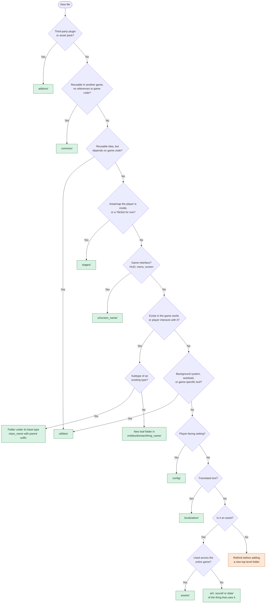

# Godot Skills

Agent Skills for Godot 4 game development. Each skill is a plain `SKILL.md` folder in the [Agent Skills](https://agentskills.io) format, so it works in Claude Code, Claude.ai, Cursor, Codex, Gemini CLI, GitHub Copilot and other agents that support skills.

## Quick start

Install a single skill with the [`skills`](https://www.npmjs.com/package/skills) CLI. It detects your coding agent and puts the skill in the right place:

```
npx skills add https://github.com/YOUR-USERNAME/godot-skills --skill godot-project-organization
```

Or install every skill in this repo:

```
npx skills add YOUR-USERNAME/godot-skills
```

Add `--list` to preview what's available, `-g` to install for all your projects, or `-a <agent>` to target a specific tool (`-a claude-code`, `-a cursor`, …).

**Claude Code plugin (alternative):**

```
claude plugin marketplace add YOUR-USERNAME/godot-skills
claude plugin install godot@godot-skills
```

**Claude.ai / Claude Desktop:** download a skill's ZIP from the [releases](https://github.com/YOUR-USERNAME/godot-skills/releases) and upload it under **Customize → Skills → + → Create skill → Upload a skill**.

## Catalog

| Skill | Scope |
|---|---|
| [`godot-project-organization`](skills/godot-project-organization/SKILL.md) | "Function First" folder structure: group by in-game function (`entities/`, `stages/`, `ui/`), not file type. Godot's official naming conventions, `common/` purity rule, and a read-only project audit script. |

## godot-project-organization

Instead of top-level `scripts/`, `scenes/` and `textures/` folders, a project is grouped by what things *are in the game*:

```
res://
├── addons/          # Third-party plugins
├── assets/          # Only game-wide assets (music, fonts)
├── common/          # Reusable, game-agnostic systems
├── config/          # Player-facing settings
├── entities/        # Everything in the game world
├── localization/    # Translations
├── stages/          # Areas and maps
├── ui/              # The game's interfaces
└── utilities/       # Game-specific helpers and autoloads
```

Each individual thing gets one folder with its scene, script and assets together:

```
entities/organisms/invertebrates/sand_crab/
├── art/
├── data/
├── sound/
├── sand_crab_organism.gd
└── sand_crab_organism.tscn
```

The skill helps your agent place new files, set up new projects, audit existing ones and plan safe reorganizations. Where a new file goes:



The audit script also runs on its own (Python 3, no dependencies, read-only, exits with 1 on errors so it works in CI):

```bash
python3 skills/godot-project-organization/scripts/audit_project.py path/to/your/godot/project
```

The full human-readable guide is in [`docs/function-first-guide.md`](docs/function-first-guide.md).

## Repository layout

```
skills/                    one folder per skill, each with a SKILL.md
docs/                      human-readable guides
.claude-plugin/            Claude Code marketplace manifest (lists every skill)
```

## Adding a skill

1. Create `skills/godot-<topic>/SKILL.md`. The folder name and the `name` field in the frontmatter must match, and should start with `godot-` so they stay unique when installed next to skills from other repos.
2. Add `"./skills/godot-<topic>"` to the `skills` list in `.claude-plugin/marketplace.json`.
3. Add a row to the catalog above.
4. Check it shows up with `npx skills add ./ --list`.

## Credits

The Function First structure is based on DevDuck's video [How I Organize My 10k+ Line Godot Project!](https://www.youtube.com/watch?v=4az0VX9ApcA), describing the organization of his game *Dauphin*, adapted to Godot's official naming conventions.

## License

MIT, see [LICENSE](LICENSE).
