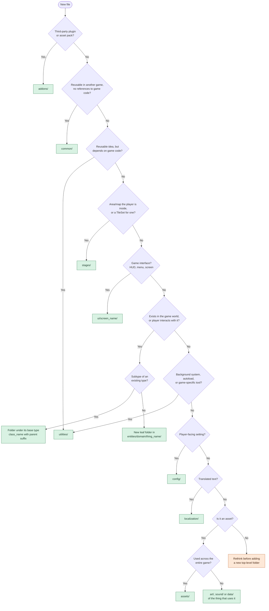

# Godot Project Organization (Function First)

Source: DevDuck, "How I Organize My 10k+ Line Godot Project!" (YouTube, Aug 2024). He walks through the file system of *Dauphin*, a ~11,000-line 2D pixel-art RPG in Godot 4.2 that he'd been developing for over four years without needing a major reorganization. He presents it as one working approach, not "the best way".

> **Adapted version.** The folder *structure* and rules below are DevDuck's, with these changes:
> - **Naming follows Godot's official conventions** (Project Organization docs and GDScript style guide): snake_case for everything on disk, PascalCase for classes and nodes, and typed exports. The original video uses PascalCase folders and files, with spaces in names.
> - **`addons/`** is added at the top level, per Godot's convention.
> - **`ui/` is a top-level folder** instead of living inside `entities/`.
> - **`common/` purity is a hard rule.** Game-specific tools go in `utilities/`.

---

## 1. The two core rules

**Rule 1: Group by in-game function first, by file type last.**
Top-level folders describe *what things are in the game* (`entities/`, `stages/`, …), not *what kind of file they are* (`scripts/`, `scenes/`, `materials/`). Folders for file types (`art/`, `sound/`, `data/`) only appear at the very bottom of the tree, inside the folder of the thing that uses them.

Why it works:
- When you add new art or a new behavior script for, say, the sand crab, there is exactly one obvious place for it.
- When the sand crab has a bug, everything related to it is in one folder.
- Unrelated files never get mixed together.

This also matches Godot's own advice to keep assets as close as possible to the scenes that use them.

**Rule 2: Keep the number of top-level folders small.**
Pick the "least common denominator" set of buckets that can hold everything, and push large groups of sibling folders at least one level down. Avoid clutter at the root.

---

## 2. Top-level layout

```
res://
├── addons/          # Third-party plugins and assets (Godot convention)
├── assets/          # Only truly game-wide assets
├── common/          # Reusable, game-agnostic systems
├── config/          # Player-facing settings / options
├── entities/        # Anything that appears in the game world (biggest folder)
├── localization/    # Translated text
├── stages/          # Areas/maps the player explores (second biggest)
├── ui/              # The game's own interfaces: HUD, menus, crafting screens
├── utilities/       # Game-specific helpers, tools and autoloads
├── default_bus_layout.tres
├── default_env.tres
└── icon.png
```

Only Godot's own project-level files sit loose at the root. `addons/` and `ui/` aren't top-level in the video; see the adaptation note above.

---

## 3. Folder by folder

### assets/
Not where most art and sound lives (that's with the scenes that use it). Holds only assets that are used across the whole game.

```
assets/
├── audio/     # soundtrack
├── credits/   # e.g. list of supporters
└── fonts/     # fonts used across UI
```

### common/
Functionality that is **not specific to this game**: no references to or dependencies on game-specific logic. Most items are fully standalone and could be copied into another project.

```
common/
├── animations/
├── collisions/
├── lights/
├── loot/
├── projectiles/
├── resolution_management/
│   └── interface_scaler/
│       ├── interface_scaler.gd     # class_name InterfaceScaler
│       └── interface_scaler.tscn
├── shaders/
├── shadows/
├── state_management/
│   └── states/
│       ├── chase/  fear/  idle/  ready/  wander/
├── time_manager/
│   ├── time_manager.gd             # class_name TimeManager
│   └── time_manager.tscn
├── tooltips/
├── transitions/
├── ui/
└── visual_effects/   (name cut off in the video, probably "Visual Effects")
```

Examples he mentions: the interface scaler (resolution options for any pixel-art game), the state machine system, general-purpose shaders, and an in-game time tracking system.

He calls this folder optional but likes it because it nudges him toward designing systems abstract enough to live here.

**Purity rule (enforced):** nothing in `common/` may reference or depend on game-specific code. That means no `class_name` types from `entities/`, `stages/`, `ui/` or `utilities/`, no `res://` paths outside `common/` (and `addons/`), and no game autoloads like `GameManager` or `GlobalSignals`.

- **Test:** could this folder be dropped into a different game with zero edits? If not, it doesn't belong here.
- **If it fails the test:** move it to `utilities/` if it's a game-specific tool or helper, or to wherever its in-game function belongs.
- **Dependency direction is one-way.** Game code may use `common/`; `common/` never uses game code. If a common system needs game data, pass it in (exports, function parameters, signals) rather than looking it up.

`common/ui/` holds generic, reusable UI building blocks. The game's actual screens live in the top-level `ui/`.

### config/
Small and nearly empty. Stores what shows up in the player's options menu: audio bus volumes, resolution, gameplay tweaks. It exists because this didn't fit anywhere else.

### entities/
The largest folder. **Anything that can appear in the game world**, especially anything the player can interact with:
the player, NPCs, organisms, items, weather effects, the base-building system, and skill-related nodes (climbing routes, mining/gathering nodes, crafting stations).

Subfolders visible in the video:

```
entities/
├── crafting/
├── environment/
├── fish/
├── foraging/
├── items/
├── npcs/
├── organisms/
├── player/
├── ships/
├── spawner/
├── terrain/
├── weather/
└── … (a few more above, not visible)
```

(In the video there is also an `entities/ui/` folder. Here it has moved to the top-level `ui/`.)

### localization/
A reserved home for localized text. Nothing in it yet, but it has a top-level spot so it stays easy to maintain once it starts.

### stages/
The areas the player can explore: islands, caves, underwater dive sites, the open ocean, building interiors, sailboat interiors. Mostly tile map implementations, handmade or procedural.

Because stages are the main users of tile maps, shared **TileSet resources** live here too, in `stages/tile_sets/` (e.g. the water tiles reused on islands and in the open ocean).

### ui/
The game's own interfaces: the player HUD, field notes, crafting and fishing screens, menus. In the video these live in `entities/ui/` because they are nodes the player interacts with; DevDuck himself says they could be a top-level folder, and here they are.

Each screen follows the leaf-folder pattern (section 5): `ui/hud/`, `ui/crafting_menu/`, and so on, each with its scene, script and `art/`/`sound/` as needed.

- Game-specific UI goes in `ui/`.
- Generic, reusable widgets (a tooltip, a transition effect) go in `common/` and must pass the purity rule.

### utilities/
Admittedly a grab bag, and that's fine. It holds **helper logic running behind the scenes** plus **game-specific tools**, including anything that would be in `common/` except that it depends on game code:
- `game_manager.gd` (`GameManager`): loading and saving the game
- `global_signals.gd` (`GlobalSignals`): a global signal bus
- `scene_manager.gd` (`SceneManager`): scene transitions and caching

Many of these, especially anything with a `Manager` suffix, are **autoload singletons**. The file is snake_case; the autoload name you register in Project Settings stays PascalCase.

---

## 4. Entities vs. stages: the key distinction

> **Entities are usually siblings of the player in the scene tree. Stages are the parent the player lives in.**

The editor in the video shows this directly. A stage scene like `coral_island.tscn` has the island as its root, with a camera, tile map and map surface underneath, plus an `Entities` node holding things like a research vessel, a fisherman's hut exterior, a workbench, and palm trees.

Node names use PascalCase with no spaces:

```
CoralIsland (stages/…/coral_island.tscn)
├── Camera
├── TileMap
├── MapSurface
└── Entities
    ├── ResearchVessel
    ├── FishermansHutExterior
    ├── Workbench
    └── PalmTree …
```

---

## 5. Pattern: the leaf folder (one thing = one folder)

At the bottom of the hierarchy, each concrete thing gets its own folder holding its scene, its script, and its own asset-type subfolders.

```
entities/organisms/
├── fish/
├── fungi/
├── invertebrates/
│   ├── coral_head/
│   ├── jellyfish/
│   ├── sand_crab/
│   │   ├── art/
│   │   ├── data/                    # relevant Resource files
│   │   ├── sound/
│   │   ├── sand_crab_organism.gd    # class_name SandCrabOrganism
│   │   └── sand_crab_organism.tscn
│   └── tube_coral/
├── mammals/
├── plants/
├── reptiles/
├── organism.gd                      # base class: class_name Organism
├── organism.tscn                    # base scene
├── organism_data.gd                 # data resource definition
├── organism_list.gd
└── organism_list.tres
```

Structure: **domain → category → individual thing → asset types.**

Leaf subfolders are only `art/`, `data/`, `sound/` as needed; the scene and its script sit next to them and share a name.

---

## 6. Pattern: inheritance mirrors the folder tree

1. Put the **base type** script at the top level of its folder.
2. Create **sibling folders for each subtype**. Each subtype folder has its own base script and, in turn, its own subtype folders.
3. Name subclasses with the **parent's name as a suffix**, so the inheritance is visible at a glance (`ToolItem` extends `Item`, `ForagingToolItem` extends `ToolItem`).
4. Concrete implementations sit at the bottom.

```
entities/items/
├── consumable/
├── equipment/
├── forageable/
├── placeable/
├── tools/
│   ├── fishing/
│   ├── foraging/
│   │   ├── foraging_tool_item.gd    # class_name ForagingToolItem extends ToolItem
│   │   └── … axe/, pickaxe/ implementations
│   ├── other/
│   ├── weapons/
│   ├── tool.gd                      # class_name Tool (the in-world scene's script)
│   ├── tool.tscn
│   └── tool_item.gd                 # class_name ToolItem extends Item
└── item.gd                          # class_name Item extends Resource
```

Reading the path tells you the type chain: items → tools → foraging → axe.

### Code

Adapted from the code shown in the video. The only change is typed exports instead of `int` with a comment: `@export_flags` for the bit-flag types, so the Inspector shows checkboxes.

`item.gd` is a `Resource`, not a node:

```gdscript
class_name Item extends Resource

# Bit flags. Update this and the @export_flags list for every new item type.
enum ItemType {
    EQUIPMENT = 1,
    TOOL = 2,
    CONSUMABLE = 4,
    PLACEABLE = 8,
    FORAGEABLE = 16,
}

@export var name: String = ""
@export var description: String = ""
@export_flags("Equipment", "Tool", "Consumable", "Placeable", "Forageable") var base_item_type: int = 0
@export var max_stack_size: int = 1
@export var inventory_texture: Texture2D

var amount: int = 1
```

`tool_item.gd` extends it and points at a separate scene for the in-world object:

```gdscript
class_name ToolItem extends Item

enum ToolItemType {
    WEAPON = 1,
    FISHING = 2,
    FORAGING = 4,
    OTHER = 8,
}

@export_flags("Weapon", "Fishing", "Foraging", "Other") var tool_item_type: int = 0
@export var tool_scene_path: String
@export var tool_equipped_texture: Texture2D
@export var player_stat_modifiers: PlayerStatModifier

var tool_instance: Tool


func _init() -> void:
    call_deferred("_load_tool")


func _load_tool() -> void:
    tool_instance = load(tool_scene_path).instantiate()


func save_to_dict() -> Dictionary:
    var save_dict: Dictionary = super.save_to_dict()
    # ...
    return save_dict
```

The `@export_flags` labels must stay in the same order as the enum's bit values, so check both whenever you add a type. If a value can only ever be one type, use `@export var base_item_type: ItemType` instead (dropdown rather than checkboxes).

Takeaways:
- **Data and behavior are split.** `ToolItem` (a Resource describing the item in the inventory) lives next to `tool.gd`/`tool.tscn` (the node that exists in the world). Organisms follow the same idea with `Organism` plus `OrganismData`.
- Type enums use **bit-flag values** (1, 2, 4, 8, 16), so one item can have several types.
- Each level of the hierarchy extends `save_to_dict()` via `super`, so saving follows the same inheritance chain as the folders.

---

## 7. Naming conventions (Godot official)

Rule of thumb: **anything on disk is snake_case; anything in code or the scene tree is PascalCase.**

| Thing | Convention | Examples |
|---|---|---|
| Folders | snake_case, no spaces | `sand_crab/`, `time_manager/`, `resolution_management/` |
| Script files | snake_case of the class name | `tool_item.gd` → `class_name ToolItem` |
| Scene files | snake_case, same name as its script | `sand_crab_organism.gd` + `sand_crab_organism.tscn` |
| Resource files | snake_case | `organism_list.tres` |
| `class_name` | PascalCase | `ToolItem`, `SandCrabOrganism` |
| Subclasses | Parent name as suffix | `ToolItem`, `ForagingToolItem`, `SandCrabOrganism` |
| Node names | PascalCase, no spaces | `MapSurface`, `ResearchVessel`, `PalmTree2` |
| Autoloads | File snake_case, registered name PascalCase, `Manager` suffix for services | `game_manager.gd` → `GameManager` |
| Data resources | `Data` / `List` suffix | `organism_data.gd`, `organism_list.tres` |
| Variables & functions | snake_case | `max_stack_size`, `save_to_dict()` |
| Enums | PascalCase name, CONSTANT_CASE members | `ItemType.EQUIPMENT` |
| Exported enum/flag values | Typed: `@export var x: MyEnum` or `@export_flags(...)` | never `int` + comment |

Why snake_case on disk: Windows and macOS file systems ignore case, but the exported `.pck` does not. A path with the wrong case works in the editor and breaks in the exported game. Lowercase-only names remove that risk.

---

## 8. Decision guide: where does a new file go?



In words:

1. **Is it a third-party plugin or asset pack?** → `addons/`
2. **Could it be reused in another game unchanged, with no references to game code?** → `common/`
   - Reusable idea but depends on game code? → `utilities/`
3. **Is it an area/map the player is inside of, or a TileSet for one?** → `stages/`
4. **Is it one of the game's interfaces (HUD, menu, crafting screen)?** → `ui/<screen>/`
5. **Does it exist in the game world, or can the player interact with it?** → `entities/<domain>/…`
   - Subtype of something existing? → folder under its base type, class named with the parent suffix.
   - New concrete thing? → its own snake_case leaf folder with the scene, script, and `art/` `data/` `sound/` as needed.
6. **Is it a background system, autoload, or game-specific tool?** → `utilities/`
7. **Is it a player-facing setting?** → `config/`
8. **Is it translated text?** → `localization/`
9. **Is it an asset used across the entire game (music, fonts)?** → `assets/`
10. **Is it an asset used by one thing?** → the `art/`/`sound/`/`data/` subfolder of that thing, never `assets/`.

If none fit, think twice before adding a new top-level folder.

---

## 9. Moving and renaming files

When reorganizing or renaming to snake_case, always do it in Godot's **FileSystem dock**, never in your OS file explorer or the terminal. The editor updates references in scenes and resources when you move files there.

The editor does **not** update paths written as strings in scripts, such as `load("res://…")`, `preload()`, or exported path strings like `tool_scene_path`. After a move, search the project for the old path (Script editor → Search → Find in Files) and fix any matches.
